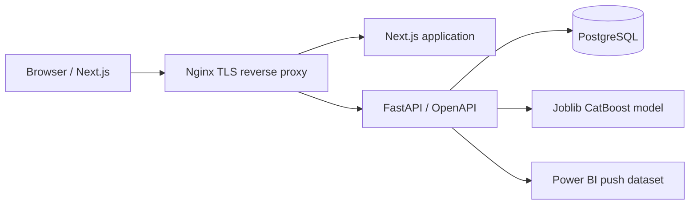
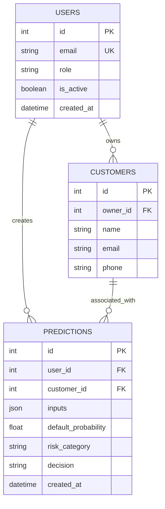

# System architecture

FastAPI validates input, authenticates JWTs, applies role checks, persists a decision, and only then submits an asynchronous Power BI event. The saved model and its decision thresholds are versioned artifacts. The UI uses the REST API and no database credentials are sent to the browser.

# Data model

